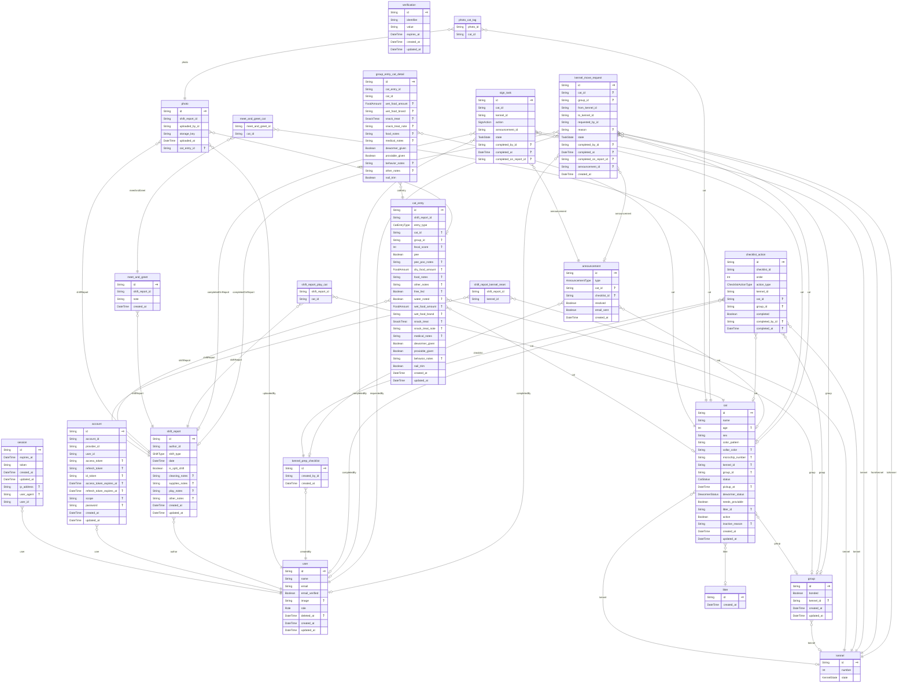

```mermaid
erDiagram

  "user" {
    String id "🗝️"
    String name 
    String email 
    Boolean email_verified 
    String image "❓"
    Role role 
    DateTime deleted_at "❓"
    DateTime created_at 
    DateTime updated_at 
    }
  

  "session" {
    String id "🗝️"
    DateTime expires_at 
    String token 
    DateTime created_at 
    DateTime updated_at 
    String ip_address "❓"
    String user_agent "❓"
    String user_id 
    }
  

  "account" {
    String id "🗝️"
    String account_id 
    String provider_id 
    String user_id 
    String access_token "❓"
    String refresh_token "❓"
    String id_token "❓"
    DateTime access_token_expires_at "❓"
    DateTime refresh_token_expires_at "❓"
    String scope "❓"
    String password "❓"
    DateTime created_at 
    DateTime updated_at 
    }
  

  "verification" {
    String id "🗝️"
    String identifier 
    String value 
    DateTime expires_at 
    DateTime created_at 
    DateTime updated_at 
    }
  

  "cat" {
    String id "🗝️"
    String name 
    Int age "❓"
    String sex 
    String color_pattern 
    String collar_color "❓"
    String microchip_number "❓"
    String kennel_id "❓"
    String group_id "❓"
    CatStatus status 
    DateTime pickup_at "❓"
    DewormerStatus dewormer_status 
    Boolean needs_proviable 
    String litter_id "❓"
    Boolean active 
    String inactive_reason "❓"
    DateTime created_at 
    DateTime updated_at 
    }
  

  "group" {
    String id "🗝️"
    Boolean bonded 
    String kennel_id "❓"
    DateTime created_at 
    DateTime updated_at 
    }
  

  "litter" {
    String id "🗝️"
    DateTime created_at 
    }
  

  "kennel" {
    String id "🗝️"
    Int number 
    KennelState state 
    }
  

  "shift_report" {
    String id "🗝️"
    String author_id 
    ShiftType shift_type 
    DateTime date 
    Boolean is_split_shift 
    String cleaning_notes "❓"
    String supplies_notes "❓"
    String play_notes "❓"
    String other_notes "❓"
    DateTime created_at 
    DateTime updated_at 
    }
  

  "shift_report_kennel_reset" {
    String shift_report_id 
    String kennel_id 
    }
  

  "cat_entry" {
    String id "🗝️"
    String shift_report_id 
    CatEntryType entry_type 
    String cat_id "❓"
    String group_id "❓"
    Int fecal_score "❓"
    Boolean pee 
    String pee_poo_notes "❓"
    FoodAmount dry_food_amount "❓"
    String food_notes "❓"
    String other_notes "❓"
    Boolean free_fed "❓"
    Boolean water_noted "❓"
    FoodAmount wet_food_amount "❓"
    String wet_food_brand "❓"
    SnackTreat snack_treat "❓"
    String snack_treat_note "❓"
    String medical_notes "❓"
    Boolean dewormer_given 
    Boolean proviable_given 
    String behavior_notes "❓"
    Boolean nail_trim 
    DateTime created_at 
    DateTime updated_at 
    }
  

  "group_entry_cat_detail" {
    String id "🗝️"
    String cat_entry_id 
    String cat_id 
    FoodAmount wet_food_amount "❓"
    String wet_food_brand "❓"
    SnackTreat snack_treat "❓"
    String snack_treat_note "❓"
    String food_notes "❓"
    String medical_notes "❓"
    Boolean dewormer_given 
    Boolean proviable_given 
    String behavior_notes "❓"
    String other_notes "❓"
    Boolean nail_trim 
    }
  

  "photo" {
    String id "🗝️"
    String shift_report_id 
    String uploaded_by_id 
    String storage_key 
    DateTime uploaded_at 
    String cat_entry_id "❓"
    }
  

  "photo_cat_tag" {
    String photo_id 
    String cat_id 
    }
  

  "meet_and_greet" {
    String id "🗝️"
    String shift_report_id 
    String note 
    DateTime created_at 
    }
  

  "meet_and_greet_cat" {
    String meet_and_greet_id 
    String cat_id 
    }
  

  "shift_report_play_cat" {
    String shift_report_id 
    String cat_id 
    }
  

  "kennel_prep_checklist" {
    String id "🗝️"
    String created_by_id 
    DateTime created_at 
    }
  

  "checklist_action" {
    String id "🗝️"
    String checklist_id 
    Int order 
    ChecklistActionType action_type 
    String kennel_id 
    String cat_id "❓"
    String group_id "❓"
    Boolean completed 
    String completed_by_id "❓"
    DateTime completed_at "❓"
    }
  

  "announcement" {
    String id "🗝️"
    AnnouncementType type 
    String cat_id "❓"
    String checklist_id "❓"
    Boolean resolved 
    Boolean email_sent 
    DateTime created_at 
    }
  

  "sign_task" {
    String id "🗝️"
    String cat_id 
    String kennel_id 
    SignAction action 
    String announcement_id 
    TaskState state 
    String completed_by_id "❓"
    DateTime completed_at "❓"
    String completed_on_report_id "❓"
    }
  

  "kennel_move_request" {
    String id "🗝️"
    String cat_id "❓"
    String group_id "❓"
    String from_kennel_id 
    String to_kennel_id 
    String requested_by_id 
    String reason "❓"
    TaskState state 
    String completed_by_id "❓"
    DateTime completed_at "❓"
    String completed_on_report_id "❓"
    String announcement_id "❓"
    DateTime created_at 
    }
  
    "session" }o--|| "user" : "user"
    "account" }o--|| "user" : "user"
    "cat" }o--|o "kennel" : "kennel"
    "cat" }o--|o "group" : "group"
    "cat" }o--|o "litter" : "litter"
    "group" }o--|o "kennel" : "kennel"
    "shift_report" }o--|| "user" : "author"
    "shift_report_kennel_reset" }o--|| "shift_report" : "shiftReport"
    "shift_report_kennel_reset" }o--|| "kennel" : "kennel"
    "cat_entry" }o--|| "shift_report" : "shiftReport"
    "cat_entry" }o--|o "cat" : "cat"
    "cat_entry" }o--|o "group" : "group"
    "group_entry_cat_detail" }o--|| "cat_entry" : "catEntry"
    "group_entry_cat_detail" }o--|| "cat" : "cat"
    "photo" }o--|| "shift_report" : "shiftReport"
    "photo" }o--|| "user" : "uploadedBy"
    "photo" }o--|o "cat_entry" : "catEntry"
    "photo_cat_tag" }o--|| "photo" : "photo"
    "photo_cat_tag" }o--|| "cat" : "cat"
    "meet_and_greet" }o--|| "shift_report" : "shiftReport"
    "meet_and_greet_cat" }o--|| "meet_and_greet" : "meetAndGreet"
    "meet_and_greet_cat" }o--|| "cat" : "cat"
    "shift_report_play_cat" }o--|| "shift_report" : "shiftReport"
    "shift_report_play_cat" }o--|| "cat" : "cat"
    "kennel_prep_checklist" }o--|| "user" : "createdBy"
    "checklist_action" }o--|| "kennel_prep_checklist" : "checklist"
    "checklist_action" }o--|| "kennel" : "kennel"
    "checklist_action" }o--|o "cat" : "cat"
    "checklist_action" }o--|o "group" : "group"
    "checklist_action" }o--|o "user" : "completedBy"
    "announcement" }o--|o "cat" : "cat"
    "announcement" }o--|o "kennel_prep_checklist" : "checklist"
    "sign_task" }o--|| "cat" : "cat"
    "sign_task" }o--|| "kennel" : "kennel"
    "sign_task" }o--|| "announcement" : "announcement"
    "sign_task" }o--|o "user" : "completedBy"
    "sign_task" }o--|o "shift_report" : "completedOnReport"
    "kennel_move_request" }o--|o "cat" : "cat"
    "kennel_move_request" }o--|o "group" : "group"
    "kennel_move_request" }o--|| "kennel" : "fromKennel"
    "kennel_move_request" }o--|| "kennel" : "toKennel"
    "kennel_move_request" }o--|| "user" : "requestedBy"
    "kennel_move_request" }o--|o "user" : "completedBy"
    "kennel_move_request" }o--|o "shift_report" : "completedOnReport"
    "kennel_move_request" }o--|o "announcement" : "announcement"
```
