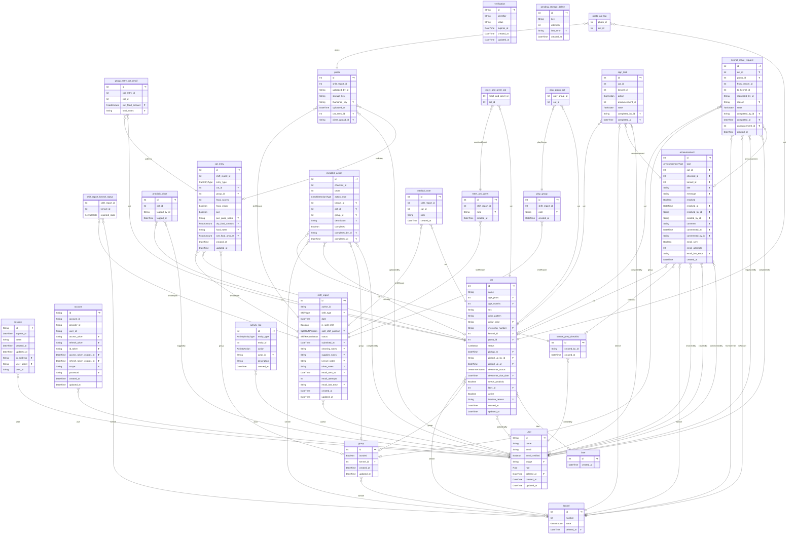

```mermaid
erDiagram

  "user" {
    String id "🗝️"
    String name 
    String email 
    Boolean email_verified 
    String image "❓"
    Role role 
    DateTime deleted_at "❓"
    DateTime created_at 
    DateTime updated_at 
    }
  

  "session" {
    String id "🗝️"
    DateTime expires_at 
    String token 
    DateTime created_at 
    DateTime updated_at 
    String ip_address "❓"
    String user_agent "❓"
    String user_id 
    }
  

  "account" {
    String id "🗝️"
    String account_id 
    String provider_id 
    String user_id 
    String access_token "❓"
    String refresh_token "❓"
    String id_token "❓"
    DateTime access_token_expires_at "❓"
    DateTime refresh_token_expires_at "❓"
    String scope "❓"
    String password "❓"
    DateTime created_at 
    DateTime updated_at 
    }
  

  "verification" {
    String id "🗝️"
    String identifier 
    String value 
    DateTime expires_at 
    DateTime created_at 
    DateTime updated_at 
    }
  

  "cat" {
    Int id "🗝️"
    String name 
    Int age_years "❓"
    Int age_months "❓"
    String sex 
    String color_pattern 
    String collar_color "❓"
    String microchip_number "❓"
    Int kennel_id "❓"
    Int group_id "❓"
    CatStatus status 
    DateTime pickup_at "❓"
    String picked_up_by_id "❓"
    DateTime picked_up_at "❓"
    DewormerStatus dewormer_status 
    DateTime dewormer_due_date "❓"
    Boolean needs_probiotic 
    Int litter_id "❓"
    Boolean active 
    String inactive_reason "❓"
    DateTime created_at 
    DateTime updated_at 
    }
  

  "group" {
    Int id "🗝️"
    Boolean bonded 
    Int kennel_id "❓"
    DateTime created_at 
    DateTime updated_at 
    }
  

  "litter" {
    Int id "🗝️"
    DateTime created_at 
    }
  

  "kennel" {
    Int id "🗝️"
    Int number 
    KennelState state 
    DateTime deleted_at "❓"
    }
  

  "shift_report" {
    Int id "🗝️"
    String author_id 
    ShiftType shift_type "❓"
    DateTime date 
    Boolean is_split_shift 
    SplitShiftPosition split_shift_position "❓"
    ShiftReportStatus status 
    DateTime submitted_at "❓"
    String cleaning_notes "❓"
    String supplies_notes "❓"
    String kennel_notes "❓"
    String other_notes "❓"
    DateTime email_sent_at "❓"
    Int email_attempts 
    String email_last_error "❓"
    DateTime created_at 
    DateTime updated_at 
    }
  

  "shift_report_kennel_status" {
    Int shift_report_id 
    Int kennel_id 
    KennelState reported_state 
    }
  

  "cat_entry" {
    Int id "🗝️"
    Int shift_report_id 
    CatEntryType entry_type 
    Int cat_id "❓"
    Int group_id "❓"
    Int fecal_scores 
    Boolean fecal_empty 
    Boolean pee 
    String pee_poop_notes "❓"
    FoodAmount dry_food_amount "❓"
    String food_notes "❓"
    FoodAmount wet_food_amount "❓"
    DateTime created_at 
    DateTime updated_at 
    }
  

  "group_entry_cat_detail" {
    Int id "🗝️"
    Int cat_entry_id 
    Int cat_id 
    FoodAmount wet_food_amount "❓"
    String food_notes "❓"
    }
  

  "probiotic_dose" {
    Int id "🗝️"
    Int cat_id 
    String logged_by_id 
    DateTime logged_at 
    }
  

  "photo" {
    Int id "🗝️"
    Int shift_report_id 
    String uploaded_by_id 
    String storage_key 
    String thumbnail_key "❓"
    DateTime uploaded_at 
    Int cat_entry_id "❓"
    String client_upload_id "❓"
    }
  

  "pending_storage_delete" {
    Int id "🗝️"
    String key 
    Int attempts 
    String last_error "❓"
    DateTime created_at 
    }
  

  "photo_cat_tag" {
    Int photo_id 
    Int cat_id 
    }
  

  "meet_and_greet" {
    Int id "🗝️"
    Int shift_report_id 
    String note "❓"
    DateTime created_at 
    }
  

  "meet_and_greet_cat" {
    Int meet_and_greet_id 
    Int cat_id 
    }
  

  "play_group" {
    Int id "🗝️"
    Int shift_report_id 
    String note "❓"
    DateTime created_at 
    }
  

  "play_group_cat" {
    Int play_group_id 
    Int cat_id 
    }
  

  "kennel_prep_checklist" {
    Int id "🗝️"
    String created_by_id 
    DateTime created_at 
    }
  

  "checklist_action" {
    Int id "🗝️"
    Int checklist_id 
    Int order 
    ChecklistActionType action_type 
    Int kennel_id "❓"
    Int cat_id "❓"
    Int group_id "❓"
    String description "❓"
    Boolean completed 
    String completed_by_id "❓"
    DateTime completed_at "❓"
    }
  

  "announcement" {
    Int id "🗝️"
    AnnouncementType type 
    Int cat_id "❓"
    Int checklist_id "❓"
    Int kennel_id "❓"
    String title "❓"
    String message "❓"
    Boolean resolved 
    DateTime resolved_at "❓"
    String resolved_by_id "❓"
    String created_by_id "❓"
    String comment "❓"
    DateTime commented_at "❓"
    String commented_by_id "❓"
    Boolean email_sent 
    Int email_attempts 
    String email_last_error "❓"
    DateTime created_at 
    }
  

  "sign_task" {
    Int id "🗝️"
    Int cat_id 
    Int kennel_id 
    SignAction action 
    Int announcement_id 
    TaskState state 
    String completed_by_id "❓"
    DateTime completed_at "❓"
    }
  

  "kennel_move_request" {
    Int id "🗝️"
    Int cat_id "❓"
    Int group_id "❓"
    Int from_kennel_id 
    Int to_kennel_id 
    String requested_by_id 
    String reason "❓"
    TaskState state 
    String completed_by_id "❓"
    DateTime completed_at "❓"
    Int announcement_id "❓"
    DateTime created_at 
    }
  

  "activity_log" {
    Int id "🗝️"
    ActivityEntityType entity_type 
    Int entity_id 
    ActivityAction action 
    String actor_id "❓"
    String description 
    DateTime created_at 
    }
  

  "medical_note" {
    Int id "🗝️"
    Int shift_report_id 
    Int cat_id 
    String note 
    DateTime created_at 
    }
  
    "session" }o--|| "user" : "user"
    "account" }o--|| "user" : "user"
    "cat" }o--|o "kennel" : "kennel"
    "cat" }o--|o "group" : "group"
    "cat" }o--|o "user" : "pickedUpBy"
    "cat" }o--|o "litter" : "litter"
    "group" }o--|o "kennel" : "kennel"
    "shift_report" }o--|| "user" : "author"
    "shift_report_kennel_status" }o--|| "shift_report" : "shiftReport"
    "shift_report_kennel_status" }o--|| "kennel" : "kennel"
    "cat_entry" }o--|| "shift_report" : "shiftReport"
    "cat_entry" }o--|o "cat" : "cat"
    "cat_entry" }o--|o "group" : "group"
    "group_entry_cat_detail" }o--|| "cat_entry" : "catEntry"
    "group_entry_cat_detail" }o--|| "cat" : "cat"
    "probiotic_dose" }o--|| "cat" : "cat"
    "probiotic_dose" }o--|| "user" : "loggedBy"
    "photo" }o--|| "shift_report" : "shiftReport"
    "photo" }o--|| "user" : "uploadedBy"
    "photo" }o--|o "cat_entry" : "catEntry"
    "photo_cat_tag" }o--|| "photo" : "photo"
    "photo_cat_tag" }o--|| "cat" : "cat"
    "meet_and_greet" }o--|| "shift_report" : "shiftReport"
    "meet_and_greet_cat" }o--|| "meet_and_greet" : "meetAndGreet"
    "meet_and_greet_cat" }o--|| "cat" : "cat"
    "play_group" }o--|| "shift_report" : "shiftReport"
    "play_group_cat" }o--|| "play_group" : "playGroup"
    "play_group_cat" }o--|| "cat" : "cat"
    "kennel_prep_checklist" }o--|| "user" : "createdBy"
    "checklist_action" }o--|| "kennel_prep_checklist" : "checklist"
    "checklist_action" }o--|o "kennel" : "kennel"
    "checklist_action" }o--|o "cat" : "cat"
    "checklist_action" }o--|o "group" : "group"
    "checklist_action" }o--|o "user" : "completedBy"
    "announcement" }o--|o "cat" : "cat"
    "announcement" }o--|o "kennel_prep_checklist" : "checklist"
    "announcement" }o--|o "kennel" : "kennel"
    "announcement" }o--|o "user" : "resolvedBy"
    "announcement" }o--|o "user" : "createdBy"
    "announcement" }o--|o "user" : "commentedBy"
    "sign_task" }o--|| "cat" : "cat"
    "sign_task" }o--|| "kennel" : "kennel"
    "sign_task" }o--|| "announcement" : "announcement"
    "sign_task" }o--|o "user" : "completedBy"
    "kennel_move_request" }o--|o "cat" : "cat"
    "kennel_move_request" }o--|o "group" : "group"
    "kennel_move_request" }o--|| "kennel" : "fromKennel"
    "kennel_move_request" }o--|| "kennel" : "toKennel"
    "kennel_move_request" }o--|| "user" : "requestedBy"
    "kennel_move_request" }o--|o "user" : "completedBy"
    "kennel_move_request" }o--|o "announcement" : "announcement"
    "activity_log" }o--|o "user" : "actor"
    "medical_note" }o--|| "shift_report" : "shiftReport"
    "medical_note" }o--|| "cat" : "cat"
```
